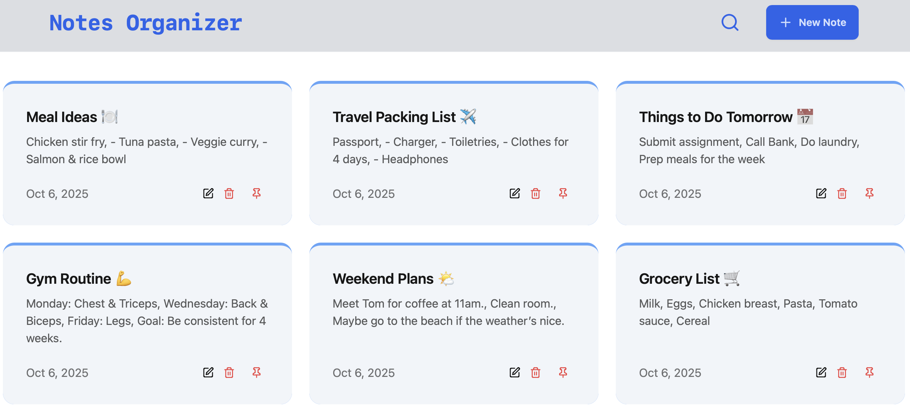

# Notes Organiser (MERN Stack)




A **full-stack MERN notes organiser application** for creating, managing, and organising notes. Built with **React, Node.js, Express, MongoDB**, and styled with **Tailwind CSS & DaisyUI**.

## Highlights / Features
- 🧱 Full-stack MERN application for managing notes efficiently
- ✨ Create, update, and delete notes with a clean title and detailed description
- 🔍 Dynamic search for notes with input debouncing for optimal performance
- 📌 Pin and unpin notes, with automatic dynamic reordering
- 🛠️ Fully functional REST API powering all operations
- ⚡ Rate limiting implemented with Upstash Redis for smooth performance
- 🚀 Fully responsive and modern user interface for desktop and mobile
- 🌐 Handles HTTP methods, status codes, and NoSQL data storage seamlessly
- 📦 Deployed and ready for use**

### .env Setup

#### Backend (`/backend`)
Create a `.env` file with:

```env
NODE_ENV="development"
MONGO_URI=<your_mongo_uri>
UPSTASH_REDIS_REST_URL=<your_redis_rest_url>
UPSTASH_REDIS_REST_TOKEN=<your_redis_rest_token>
```

#### 🔧 Run the Backend

```
cd backend
npm install
npm run dev
```

#### 💻 Run the Frontend

```
cd frontend
npm install
npm run dev
```

